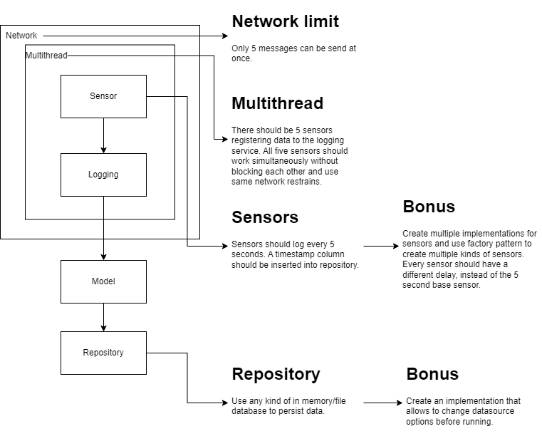

# Hello #FutureShaper
I am glad that you passed the first stages of the interview process. Now is the time to show us what you got!

## The objective: 
Create an application that simulates sensors logging info to a persistent datasource.
 With the following restraints:
- Simulate the interaction between sensors and network, the network should have a limit of 5 messages maximum at once.
- Use multithreading, create 5 sensors that should be registering to the log service. All five sensors should work 
simultaneously without blocking each other and use same network restrains.
- Sensors should log every 5 seconds, and a timestamp should persist onto datasource.
- Sensors most generate the following info, timestamp, sensor name, value (integer between -100 and 100).
- Model, most define all properties needed to persist data into datasource.
- Model most have a timestamp type, id, sensor name, value.
- Repository class should contain all logic needed to use a file/memory database, and convert logic for model to allow 
insertion into database.
- Use PEP8 conventions for coding.

### EXTRA
- Sensors: create multiple sensors using the default sensor of 5 seconds delay as base, 
and use factory pattern to create multiple types sensors with varying delay time.
- Repository: create an implementation that allows to change datasource options before running.
- Use type hinting.

Modify classes or create new ones as you find needed, also you are free to use whatever library you want.
Don't forget to include the requirements file.

#### FORK THIS REPO, DO NOT CREATE PR, JUST FORK IT AND SHARE US THE URL.
